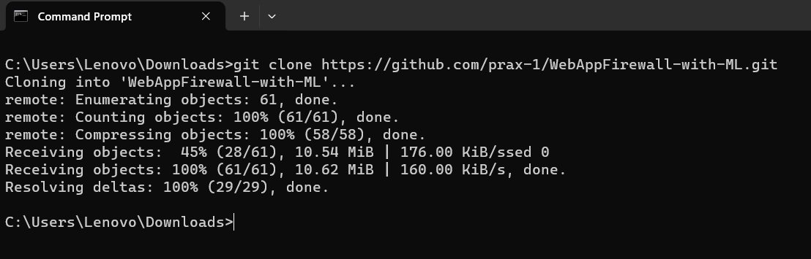
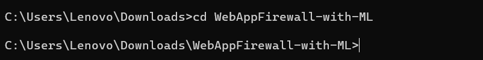
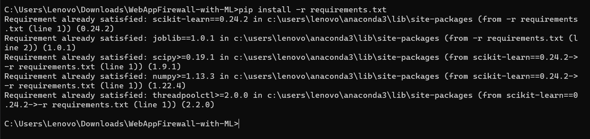
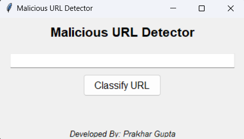

# Web Application Firewall with Machine Learning

This project implements a simple web application firewall (WAF) that uses a machine learning model (Random Forest) to classify URLs as either malicious or safe. The goal is to detect and block potential security threats such as SQL injection and cross-site scripting (XSS) attacks.

## Features

- Real-time classification of URLs
- Integration of a pre-trained Random Forest model
- Use of TF-IDF vectorization for URL preprocessing
- Tkinter-based graphical user interface (GUI) for easy interaction

## Prerequisites

- Python 3.x
- Required Python packages (install via `pip install -r requirements.txt`):
  - Scikit-learn
  - Joblib
  - Tkinter (for GUI)

## Getting Started

1. Clone the repository:
   
   ```bash
   git clone https://github.com/prax-1/WebAppFirewall-with-ML.git
2. Navigate to the project directory
   
   ```bash
   cd WebAppFirewall-with-ML
4. Install the required packages:
   
   ```bash
   pip install -r requirements.txt

6. Train the Model (This step will take time according to your CPU)
   
   ```bash
   python script_main.py

8. Run the GUI
   ```bash
   python gui.py
  
## Usage
1. Enter a URL in the provided input field.
2. Click the "Classify URL" button to see the classification result.
3. The GUI will display whether the URL is classified as "Malicious" or "Safe."



## Customization
Feel free to customize and extend the project based on your specific requirements. For example:
1. Train your own machine learning model with a different dataset.
2. Implement additional features in the GUI for a richer user experience.

## Credits
This project is developed by [Prakhar Gupta](https://github.com/prax-1). Contributions and suggestions are welcome.

## License
This project is licensed under the [MIT License](https://github.com/prax-1/WebAppFirewall-with-ML/blob/main/LICENSE).
